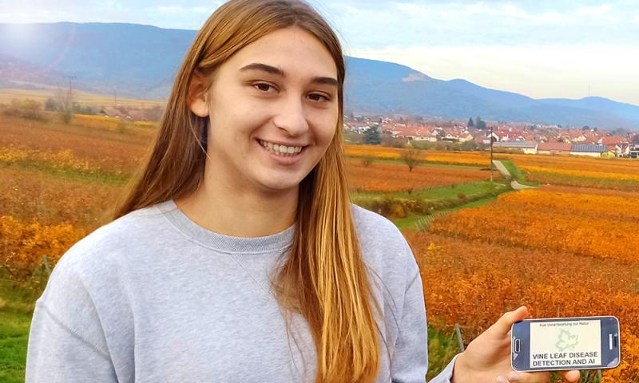

# Welcome to my homepage

## About me:
Hi! My name Maria-Theresa and I am 17 years old. I'm a 12th grade student at the Elisabeth von Thadden School. I have always been fascinated by [MINT](https://master-mint.de/): Mathematics, Informatics, Natural Science, and Technology subjects ([more info](https://de.wikipedia.org/wiki/MINT-F%C3%A4cher)), therefore I started to do small MINT projects very early on. Now, as I have gained more understanding of these topics, I am more and more interested in Informatics, especially in Artificial Intelligence (AI) and Machine Learning (ML). I am also very interested in medicine and biology. 

In my free time, I play sports. I have been playing tennis since I was 7 years old, but since 2015 I am focussing more on golf, which now I play at competitive level. 

  I also love to play piano, which I have been learning for more then 9 years.

| **[Check Out My Projects](https://matheli.github.io/Maria-Theresa_Licka/My_Projects)** |

## Gallery
<table>
  <th align="center"></th>
  <th></th>
  <th></th>
</table>
*Stanford expedition Silicon Valley, Image source: https://master-mint.de/usa-2018*
*EMBL Researchers Night 2018, Image source: https://news.embl.de/events/ern2018/*

### EMBL Teens Project

#### Learn more about:

[Vine Leaf Disease and AI](https://matheli.github.io/Vine-leaf-diseases-and-AI/)

[Fall Detection App/AI](https://matheli.github.io/Fall_Detection_App_AI/)

[EMBL Women in Science Project](https://malvikasharan.github.io/EMBL-Women-2019/)

01.01.2021
